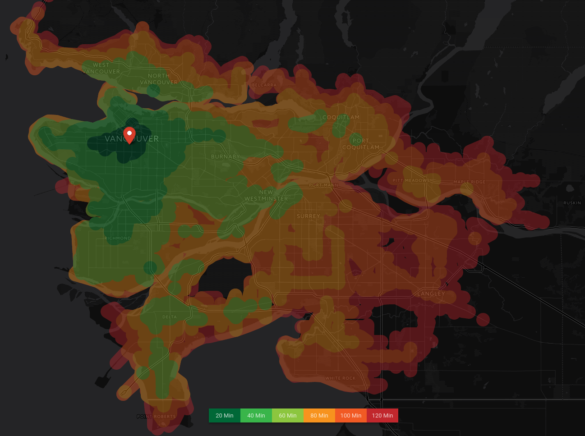

# Important notice: Route360° is now called Targomo. The libraries here will no longer be maintained. We will keep them here for legacy purposes but for future use please visit: [github.com/targomo/targomo-js](https://github.com/targomo/targomo-js) For support on Leaflet and GoogleMaps please visit [targomo-js-leaflet](https://github.com/targomo/targomo-js-leaflet) and [targomo-js-googlemaps](https://github.com/targomo/targomo-js-googlemaps)

# r360-js

## API-Key
Get your API key [here ](https://www.targomo.com/developers/pricing/).

The Route360° JavaScript API is a modern open-source JavaScript library designed for Leaflet's mobile-friendly interactive maps. It is developed by Henning Hollburg and Daniel Gerber from the Motion Intelligence GmbH.

# Features

* Generate polygons which represent the area which is reachable from a given source point
* Supported for **walk**, **car**, **bike** and **transit** routing
* A number of predefined map controls (travel time slider, date and time chooser, travel type chooser, etc.)
* Detailed routing information from source to target (travel time, transit trips, etc.)
* Get routing information for hundreds of POIs in a single request in milliseconds
* Support for elevation data

# Demonstration and Usage
A demonstration of the library's features, as well as detailed coding examples can be found [here](https://www.targomo.com/developers/documentation/javascript/code_example/). You can see what the service is capable of at the technology [demo](https://app.targomo.com/demo/#!/), just select the country you want to test.

# Build
`npm run build`

# Npm
You can use our project with npm

    npm install route360 --save

# Bower
You can use our project in bower

    bower install route360 --save
